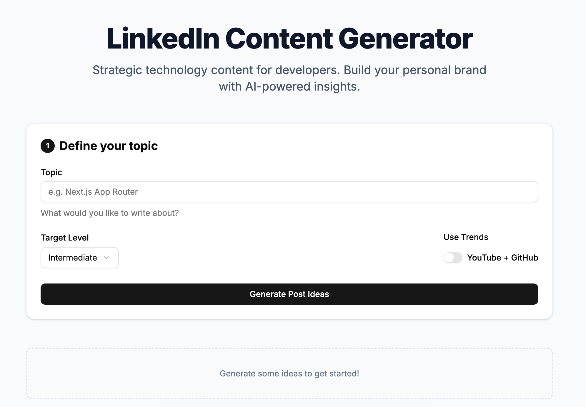

# 🚀 LinkedIn Content Generator

A professional grade, AI-powered content generator designed for developers and tech professionals to build their personal brand on LinkedIn with strategic, insight-driven posts.



## 🌟 Key Features

### 🔐 Secure Authentication
- **OAuth Integration**: Sign in seamlessly with **GitHub** or **Google** via Supabase Auth.
- **Protected Routes**: Secure dashboard and generation API endpoints.

### 📊 Usage Control & Personalization
- **Plan-Based Limits**: Tiered usage control (Free, Plus, Gold, Platinum).
- **Daily Budgeting**: Real-time tracking of generations and rewrites.
- **Smart Logic**: Rewrites count as half-usage to encourage refinement.

### 💾 Local-First Data Strategy
- **Privacy First**: All your generated ideas and posts are stored in your browser's **IndexedDB**.
- **No Cloud Persistence**: We don't save your content on our servers—it's yours and yours alone.
- **Preferences**: Remembers your preferred topics, levels, and settings via `localStorage`.

### 🧠 Advanced AI Generation
- **Idea Generation**: Brainstorm high-impact angles for any tech topic.
- **LinkedIn-Specific Hooks**: Crafted to capture attention in the feed.
- **Trend Aware**: Optional integration with latest YouTube and GitHub trends for relevant context.

---

## 🛠 Tech Stack

- **Framework**: [Next.js 16](https://nextjs.org/) (App Router & Turbo)
- **Authentication**: [Supabase Auth](https://supabase.com/auth)
- **AI Integration**: [OpenRouter API](https://openrouter.ai/)
- **UI Components**: [Shadcn UI](https://ui.shadcn.com/) & [Tailwind CSS 4](https://tailwindcss.com/)
- **State Management**: [Zustand](https://zustand-demo.pmnd.rs/)
- **Local Storage**: [IndexedDB (via `idb`)](https://www.npmjs.com/package/idb)

---

## 🚀 Getting Started

### 1. Prerequisites
- Node.js (Latest LTS)
- A Supabase project
- An OpenRouter API Key

### 2. Installation
```bash
git clone https://github.com/guimullerdev/linkedin-generator.git
cd linkedin-generator
yarn install
```

### 3. Environment Setup
Create a `.env.local` file in the root directory:
```env
# AI API
OPENROUTER_API_KEY=your_key
OPENROUTER_MODEL=your_preferred_model

# Supabase Configuration
NEXT_PUBLIC_SUPABASE_URL=your_supabase_url
NEXT_PUBLIC_SUPABASE_ANON_KEY=your_supabase_anon_key
SUPABASE_SERVICE_ROLE_KEY=your_service_role_key # For server-side usage logic
```

### 4. Database Setup (Supabase)
Run the following SQL in your Supabase SQL Editor:
```sql
create table public.profiles (
  id uuid primary key references auth.users(id) on delete cascade,
  plan text not null default 'free',
  created_at timestamptz default now()
);

create table public.usage_logs (
  id uuid primary key default gen_random_uuid(),
  user_id uuid not null references public.profiles(id) on delete cascade,
  date date not null default current_date,
  count int not null default 0,
  unique (user_id, date)
);
```

### 5. Running the App
```bash
yarn dev
```
Open [http://localhost:3000](http://localhost:3000) to start generating.

---

## 🏗 Roadmap

- [x] V1.1: OAuth, Usage Limits, Local Storage
- [ ] V1.2: Content Calendar & History Visualizer
- [ ] V1.3: "Mark as Posted" Tracking
- [ ] V1.4: Real-time Analytics Integration

---

## 📄 License
MIT License - feel free to use and contribute!
